# 🏠 Raspberry Pi Homelab: System Monitoring & Network Management

> Automated system health monitoring, network-wide ad blocking, and containerized observability — all running on a single Raspberry Pi.

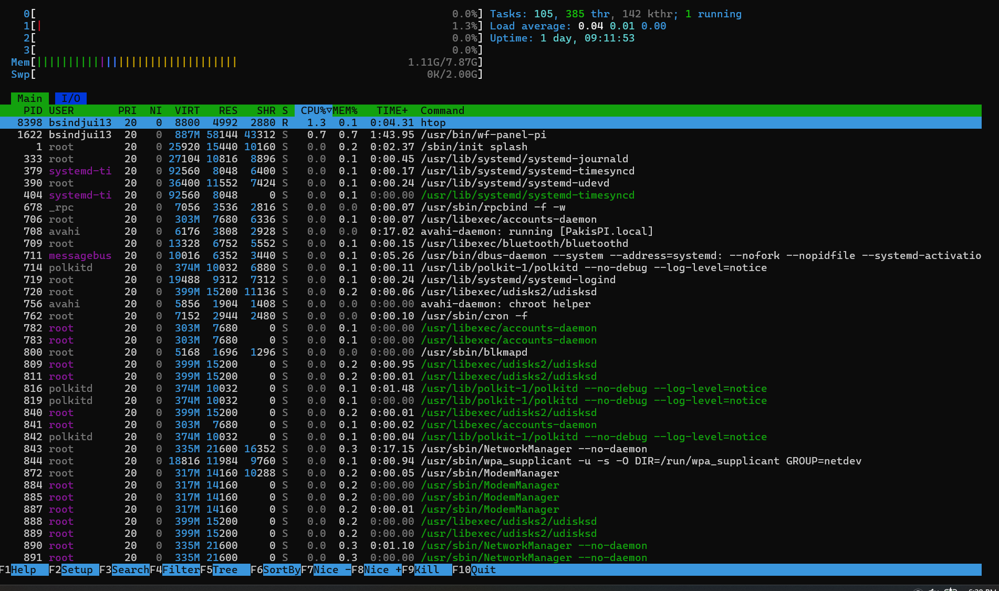

---

## 👋 About This Project

I'm a Computer Science student with a passion for exploring technology at every level — from low-level systems and networking to cloud infrastructure and automation. I built this homelab to push beyond writing code in isolation and get hands-on with the kind of real infrastructure work that matters in cloud, DevOps, SRE, and Linux-focused roles. What drew me to this project was the challenge of tying everything together on one device: Pi-hole for DNS-level ad blocking, a bash monitoring script that checks every critical system metric, Docker running a full Prometheus + Grafana observability stack, and cron delivering automated email reports twice a day — all coordinated on a Raspberry Pi running 24/7. This project gave me practical exposure to Linux administration, bash scripting, containerization, SMTP configuration, and systems observability in a way that no classroom assignment could replicate.

---

## 📊 Live Stats

| Metric | Value |
|---|---|
| DNS Queries Processed | 694,255 / day |
| Ads Blocked | 99,642 / day |
| Block Rate | 14.4% |
| CPU Usage | ~2.3% idle |
| Memory Usage | 1.2 GB / 7.9 GB (15.3%) |
| Disk Usage | 9.7 GB / 115 GB (9%) |
| CPU Temperature | 49.4°C |
| System Uptime | 1 day, 7 hours |

---

## 🔍 What This Does

This project runs four interconnected services on a single Raspberry Pi:

**Pi-hole** acts as the DNS server for the entire home network, blocking ad-serving and tracking domains before they reach any device — no browser extension needed, works on phones, TVs, and IoT devices automatically.

**pi-status-report.sh** is a custom bash script that collects CPU temperature, CPU usage, memory, disk, network connectivity, Pi-hole stats, Docker container status, and failed systemd services — then formats all of it into a structured report.

**Cron** triggers the monitoring script at 9:30 AM and 10:00 PM every day, so system health is always visible without manually checking anything.

**Docker (Prometheus + Grafana)** provides a persistent time-series metrics stack for longer-term observability and visualization beyond what the email reports capture.

---

## 🏗️ Architecture

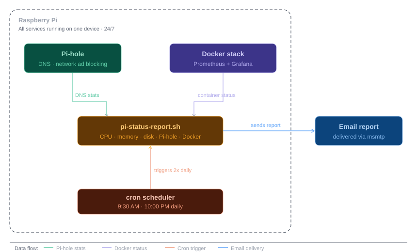

The monitoring script sits at the center — it pulls DNS stats from Pi-hole, container status from Docker, and system metrics directly from the OS. Cron fires it twice daily and msmtp delivers the result to email. All four services run concurrently on the same device.

---

## ✨ Features

- **Automated health checks** — CPU, memory, disk, network, and temperature monitoring
- **Email alerts** — twice-daily reports at 9:30 AM and 10:00 PM
- **Threshold warnings** — alerts when disk > 80%, memory > 80%, or CPU temp > 70°C
- **Failed service detection** — systemd service health checked on every run
- **Pi-hole integration** — DNS query and block stats included in every report
- **Docker container monitoring** — Prometheus and Grafana status in every report
- **Network-wide ad blocking** — protects all devices without per-device setup
- **Runs 24/7 on low power** — ~5W continuous draw

---

## 📧 Email Report Format

Every report looks like this:

```
================================================================
          Pi-hole & System Status Report
          Generated: 2026-03-13 16:26:48
================================================================

SYSTEM INFORMATION
----------------------------------------------------------------
  CPU Temperature:    49.4°C
  CPU Usage:          2.3%
  Memory Usage:       1.2Gi/7.9Gi (15.3%)
  Disk Usage:         9.7G/115G (9%)
  System Uptime:      up 1 day, 7 hours, 0 minutes

PI-HOLE STATUS
----------------------------------------------------------------
  DNS Queries Today:    694,255
  Ads Blocked Today:    99,642
  Blocking Percentage:  14.4%

DOCKER CONTAINERS
----------------------------------------------------------------
  prometheus    Up 2 days
  grafana       Up 2 days

ALERTS & WARNINGS
----------------------------------------------------------------
  ✓ All system metrics healthy
```

---

## 🖥️ Screenshots

### Email Status Report
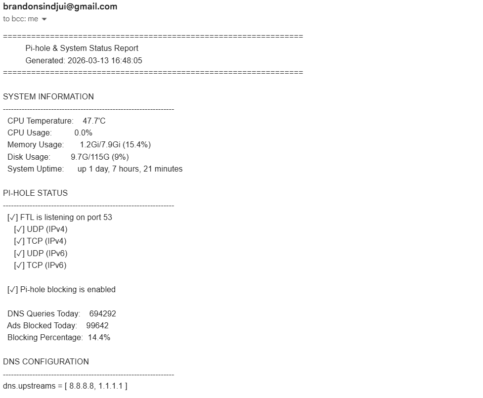
*Automated twice-daily system health report delivered via msmtp — shows CPU, memory, disk, Pi-hole stats, Docker status, and any threshold warnings in a single structured email.*

### Pi-hole Dashboard
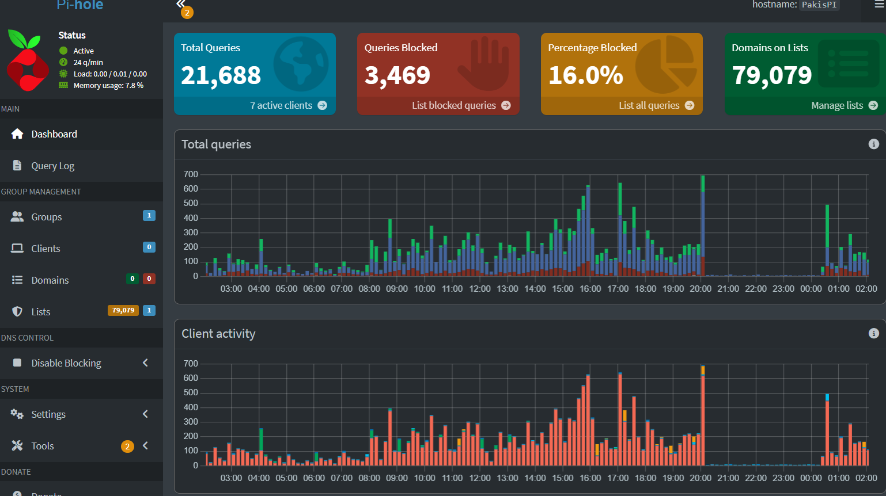
*Network-wide ad blocking statistics showing 694,255 DNS queries processed with 14.4% blocked — all devices on the network protected without any per-device configuration.*

### System Monitoring (htop)

*Real-time system resource view showing CPU at ~2.3% usage and 1.2 GB / 7.9 GB memory — confirms the full stack runs comfortably within Raspberry Pi hardware limits.*

### Docker Containers
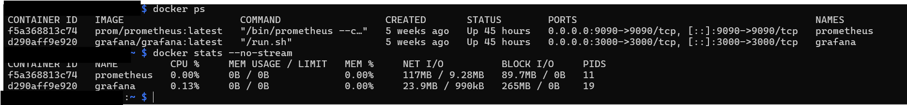
*Prometheus and Grafana containers running the observability stack — both containers configured with persistent volumes so data survives reboots.*

### Cron Configuration
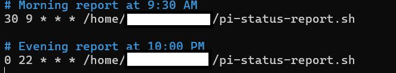
*Crontab entries scheduling the monitoring script at 9:30 AM and 10:00 PM daily — no manual intervention needed after initial setup.*

### Cron Verification
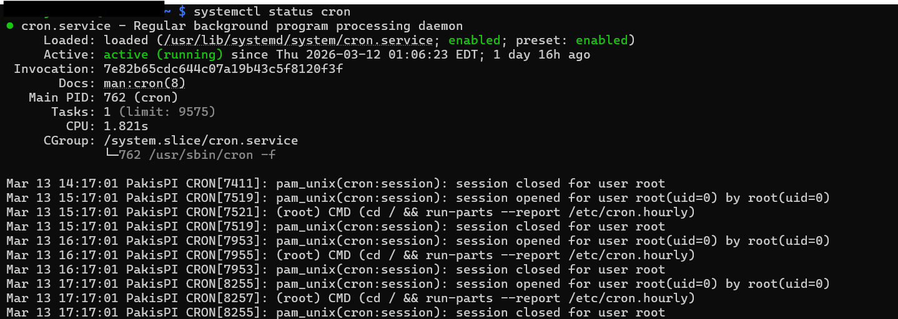
*Confirming the cron jobs are registered and active.*

### Script Creation
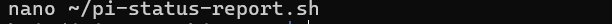
*Writing the monitoring script directly on the Pi.*

### Script Permissions
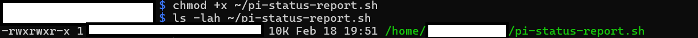
*Setting executable permissions with `chmod +x` before first run.*

### Script Execution
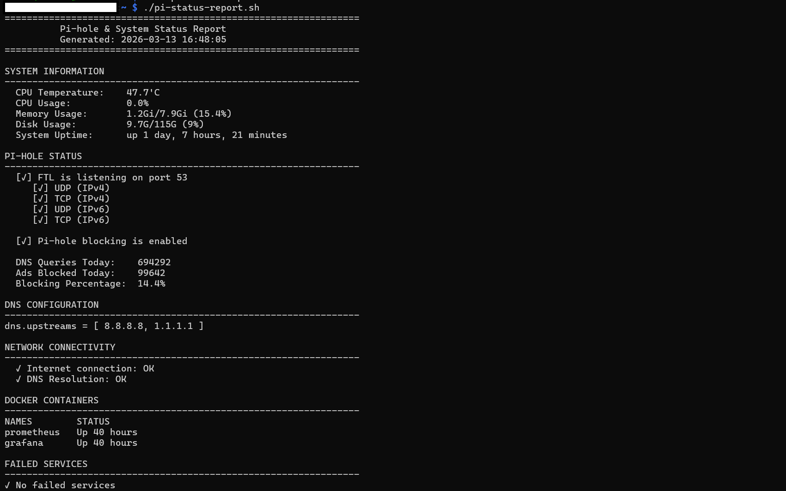
*Manual test run of the monitoring script to verify output before automating with cron.*

### Network Configuration
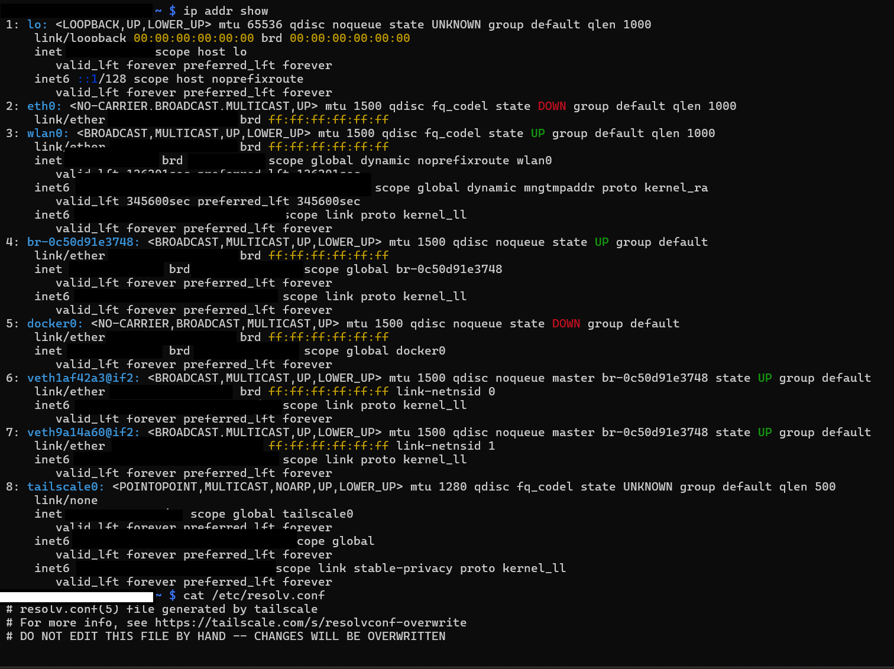
*Network interface configuration showing the Pi's connection to the home network.*

---

## 🛠️ Hardware & Software

### Hardware
| Component | Details |
|---|---|
| Device | Raspberry Pi 4 |
| RAM | 8 GB |
| Storage | MicroSD 32GB+ |
| OS | Raspberry Pi OS (64-bit) |
| Architecture | `linux/arm64/v8` |
| Power | ~5W continuous |

### Software Stack
| Tool | Purpose |
|---|---|
| Pi-hole v6.3+ | DNS ad blocking |
| Bash | Monitoring script |
| cron | Job scheduling |
| msmtp | Email delivery (SMTP) |
| Docker | Container runtime |
| Prometheus | Metrics collection |
| Grafana | Metrics visualization |

---

## 🚀 Installation Guide

### Prerequisites

```bash
sudo apt update && sudo apt upgrade -y
sudo apt install -y curl git htop docker.io msmtp msmtp-mta
```

### 1. Install Pi-hole

```bash
curl -sSL https://install.pi-hole.net | bash
```

During setup: select your network interface (`wlan0` or `eth0`), choose upstream DNS (Google or Cloudflare), install the web interface, and enable query logging.

### 2. Set Up the Monitoring Script

```bash
mkdir -p ~/scripts
# Copy pi-status-report.sh from this repository
chmod +x ~/scripts/pi-status-report.sh

# Test it manually first
~/scripts/pi-status-report.sh
```

### 3. Configure Email (msmtp + Gmail)

```bash
cat > ~/.msmtprc << EOF
defaults
auth           on
tls            on
tls_trust_file /etc/ssl/certs/ca-certificates.crt
logfile        ~/.msmtp.log

account        gmail
host           smtp.gmail.com
port           587
from           your-email@gmail.com
user           your-email@gmail.com
password       your-app-password
EOF

chmod 600 ~/.msmtprc
```

> Use a [Gmail App Password](https://support.google.com/accounts/answer/185833), not your regular password.

### 4. Schedule with Cron

```bash
crontab -e
```

Add these two lines:

```bash
# Morning report at 9:30 AM
30 9 * * * /home/YOUR_USERNAME/scripts/pi-status-report.sh

# Evening report at 10:00 PM
0 22 * * * /home/YOUR_USERNAME/scripts/pi-status-report.sh
```

### 5. Deploy Docker Monitoring Stack

```bash
mkdir -p ~/monitoring && cd ~/monitoring

cat > docker-compose.yml << EOF
version: '3'
services:
  prometheus:
    image: prom/prometheus:latest
    container_name: prometheus
    ports:
      - "9090:9090"
    volumes:
      - ./prometheus.yml:/etc/prometheus/prometheus.yml
      - prometheus_data:/prometheus
    restart: unless-stopped

  grafana:
    image: grafana/grafana:latest
    container_name: grafana
    ports:
      - "3000:3000"
    volumes:
      - grafana_data:/var/lib/grafana
    restart: unless-stopped

volumes:
  prometheus_data:
  grafana_data:
EOF

docker-compose up -d
```

---

## ⚙️ Configuration

### Alert Thresholds (in script)

```bash
DISK_THRESHOLD=80       # Warn when disk usage exceeds 80%
MEM_THRESHOLD=80        # Warn when memory usage exceeds 80%
CPU_TEMP_THRESHOLD=70   # Warn when CPU temp exceeds 70°C
```

### Report Schedule (cron)

```bash
30 9  * * *   # Morning report — 9:30 AM
0  22 * * *   # Evening report — 10:00 PM
```

See [`config/crontab-example.txt`](config/crontab-example.txt) for the full cron reference.
See [`config/msmtp-example.conf`](config/msmtp-example.conf) for the email configuration template.

---

## 📈 Performance

| Resource | Usage |
|---|---|
| CPU (idle) | < 5% |
| CPU (under load) | < 15% |
| Memory | ~1.2 GB / 8 GB |
| Disk | ~10 GB total |
| Prometheus RAM | < 100 MB |
| Grafana RAM | < 200 MB |
| Network overhead | Minimal (DNS only) |

---

## 🔒 Security

- No hardcoded credentials — email password stored in `~/.msmtprc` with `chmod 600`
- Docker containers run on isolated networks
- Pi-hole not exposed to the internet — local DNS only
- All sensitive config files excluded via `.gitignore`

---

## 🛠️ Maintenance

```bash
# Update Pi-hole
pihole -up && pihole -g

# Update system packages
sudo apt update && sudo apt upgrade -y

# Update Docker containers
cd ~/monitoring && docker-compose pull && docker-compose up -d

# Backup Pi-hole settings
pihole -a teleporter

# Backup crontab
crontab -l > ~/crontab-backup.txt
```

---

## 🔧 Troubleshooting

**Emails not sending:**
```bash
echo "Test" | msmtp your-email@gmail.com
cat ~/.msmtp.log
systemctl status cron
```

**Pi-hole not blocking:**
```bash
pihole status
sudo systemctl restart pihole-FTL
pihole -g
```

**Docker containers not starting:**
```bash
docker logs prometheus
docker logs grafana
docker-compose restart
```

---

## 🎓 What I Learned

- Linux system administration — systemd, cron, process management, file permissions
- Bash scripting — collecting system metrics, conditional logic, formatted output, error handling
- Docker and containerization — multi-container apps, persistent volumes, resource optimization on embedded hardware
- Network administration — DNS, DHCP, routing, Pi-hole configuration
- Monitoring and observability — metrics collection with Prometheus, visualization with Grafana
- Email systems — SMTP configuration with msmtp, Gmail App Passwords, secure credential storage
- Debugging real systems — fixed memory calculation bugs in the script, debugged SMTP delivery issues, resolved Docker resource constraints on ARM hardware

---

## 🔮 Future Enhancements

- [ ] Grafana dashboard pulling live Pi-hole metrics
- [ ] Telegram or Discord alerts instead of (or alongside) email
- [ ] WireGuard VPN for secure remote access to the dashboard
- [ ] Redundant Pi-hole on a second Pi for high availability
- [ ] Automated backup to cloud storage (S3 or Backblaze)
- [ ] Home Assistant integration
- [ ] Network traffic analysis with ntopng

---

## 📂 Repository Structure

```
raspberry-pi-homelab/
├── README.md
├── .gitignore
├── scripts/
│   └── pi-status-report.sh        # Main monitoring script
├── config/
│   ├── crontab-example.txt        # Cron schedule reference
│   └── msmtp-example.conf         # Email config template (credentials redacted)
└── docs/
    ├── architecture-diagram.svg   # System architecture diagram
    ├── 02-script-creation.png
    ├── 03-script-permissions.png
    ├── 04-script-execution.png
    ├── 05-email-report.png
    ├── 06-cron-setup.png
    ├── 07-cron-verification.png
    ├── 08-pihole-dashboard.png
    ├── 09-system-monitoring-htop.png
    ├── 10-docker-containers.png
    └── 11-network-config.png
```

---

## 📚 Resources

- [Pi-hole Documentation](https://docs.pi-hole.net/)
- [Prometheus Documentation](https://prometheus.io/docs/)
- [Grafana Documentation](https://grafana.com/docs/)
- [Docker Documentation](https://docs.docker.com/)
- [msmtp Documentation](https://marlam.de/msmtp/)

---

## 👤 Contact

**Brandon Sindjui**

- **LinkedIn:** [linkedin.com/in/brandon-sindjui](https://www.linkedin.com/in/brandon-sindjui-349916253/)
- **GitHub:** [github.com/BSindjui1](https://github.com/BSindjui1)

---

## 📄 License

This project is provided for educational purposes. Feel free to use, modify, and distribute with attribution.